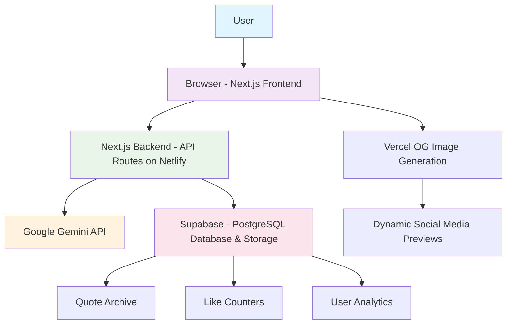
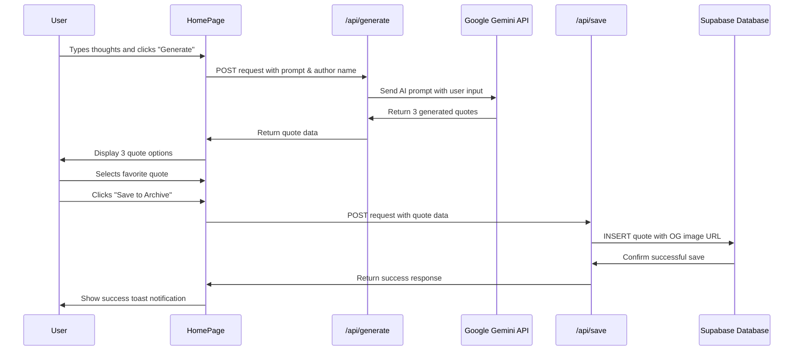

# Quote of the Day

[](https://app.netlify.com/sites/quote-of-the-day-yuyavibes/deploys)

A modern web application that transforms your daily thoughts into personalized, AI-generated quotes with beautiful social sharing capabilities.

🌐 **Live Demo:** [https://www.yuyavibes.me/](https://www.yuyavibes.me/)

## ✨ Features

- **AI-Powered Quote Generation** - Transform your daily thoughts into meaningful quotes using Google Gemini AI
- **Personalized Authorship** - Every generated quote features your own name or handle as the author
- **Smart Quote Selection** - Choose from 3 unique AI-generated quotes tailored to your input
- **Cloud-Based Archive** - Persistent storage of your favorite quotes using Supabase Postgres database
- **Dynamic Social Sharing** - Auto-generated OG images for beautiful social media previews using Vercel's `@vercel/og`
- **Interactive Like System** - Anonymous like functionality with real-time counters stored in the database
- **Quote Carousel** - Homepage slideshow displaying your recently saved quotes with auto-play
- **Modern UI/UX** - Responsive design with toast notifications and smooth animations
- **Social Media Integration** - One-click sharing to X (Twitter) with custom URLs
- **Search & Filter** - Full-text search and category filtering in the quote archive
- **Bolt.new Integration** - Includes sponsorship badge as per hackathon requirements

## 🛠️ Tech Stack & Architecture

- **Frontend:** Next.js 14 (App Router), React 18, TypeScript, Tailwind CSS, shadcn/ui
- **Backend:** Next.js API Routes (Serverless Functions)
- **Database & Storage:** Supabase (PostgreSQL Database with Row Level Security)
- **AI & Image Generation:** Google Gemini 2.0 Flash Lite API, Vercel OG (`@vercel/og` with Satori)
- **Deployment:** Netlify (Frontend & API Routes)
- **Development Environment:** Bolt.new, Cursor IDE (Local Development)
- **Package Manager:** pnpm (for improved stability and performance)

## 📊 Diagrams

### System Architecture



### User Flow: Generate & Save



## 🚀 Getting Started

### Prerequisites

- Node.js 18+ 
- pnpm (recommended) or npm
- Git

### Installation

1. **Clone the repository**
   ```bash
   git clone https://github.com/Yuya-Ishibashi0/Quote-of-the-Day.git
   cd Quote-of-the-Day
   ```

2. **Install dependencies**
   ```bash
   pnpm install
   ```
   *Note: We recommend pnpm as it provides better stability and performance for this project.*

3. **Set up environment variables**
   
   Create a `.env.local` file in the root directory and add the required environment variables (see section below).

4. **Run the development server**
   ```bash
   pnpm dev
   ```

5. **Open your browser**
   
   Navigate to [http://localhost:3000](http://localhost:3000) to see the application.

## 📝 Environment Variables

Create a `.env.local` file in your project root with the following variables:

```env
# Google Gemini AI API Key
GEMINI_API_KEY=your_gemini_api_key_here

# Supabase Configuration
NEXT_PUBLIC_SUPABASE_URL=your_supabase_project_url
NEXT_PUBLIC_SUPABASE_ANON_KEY=your_supabase_anon_key

# Site URL for OG image generation (use your domain in production)
NEXT_PUBLIC_SITE_URL=https://your-domain.com
```

### Getting API Keys

- **Gemini API Key:** Get your free API key from [Google AI Studio](https://makersuite.google.com/app/apikey)
- **Supabase:** Create a free project at [supabase.com](https://supabase.com) and find your keys in Project Settings > API

## 🗄️ Database Schema

The application uses a simple but effective PostgreSQL schema via Supabase:

```sql
-- Quotes table with RLS enabled
CREATE TABLE quotes (
  id SERIAL PRIMARY KEY,
  created_at TIMESTAMPTZ DEFAULT NOW(),
  text TEXT NOT NULL,
  author TEXT NOT NULL,
  category TEXT NOT NULL,
  image_url TEXT,
  like_count INTEGER DEFAULT 0
);

-- Enable Row Level Security
ALTER TABLE quotes ENABLE ROW LEVEL SECURITY;

-- Public read access policy
CREATE POLICY "Allow public read access" ON quotes
  FOR SELECT USING (true);

-- Public insert access policy  
CREATE POLICY "Allow public insert access" ON quotes
  FOR INSERT WITH CHECK (true);
```

## 🎨 Key Features Deep Dive

### AI Quote Generation
- Uses Google Gemini 2.0 Flash Lite for fast, high-quality text generation
- Intelligent prompt engineering to create meaningful, contextual quotes
- Generates 3 unique options per request for user choice

### Dynamic OG Images
- Real-time generation using Vercel's `@vercel/og` library
- Responsive text sizing based on quote length
- Beautiful gradient backgrounds with category badges
- Optimized for social media sharing (1200x630px)

### Archive System
- Full-text search across quote content and authors
- Category-based filtering
- Responsive grid layout with hover effects
- Persistent like counts with optimistic UI updates

## 🚀 Deployment

This project is optimized for deployment on Netlify:

1. **Connect your GitHub repository** to Netlify
2. **Set build command:** `pnpm build`
3. **Set publish directory:** `.next`
4. **Add environment variables** in Netlify dashboard
5. **Deploy!**

The project includes proper Next.js configuration for static export and API route handling on Netlify.

## 🤝 Contributing

Contributions are welcome! Please feel free to submit a Pull Request. For major changes, please open an issue first to discuss what you would like to change.

## 📄 License

This project is open source and available under the [MIT License](LICENSE).

## 🙏 Acknowledgements

This project was built with the incredible tools and platforms that make modern web development possible:

- **[Bolt.new](https://bolt.new/)** - The AI-powered development environment that made rapid prototyping and iteration possible
- **[Supabase](https://supabase.com/)** - For providing an excellent PostgreSQL database and real-time capabilities
- **[Google AI](https://ai.google.dev/)** - For the powerful Gemini API that brings AI quote generation to life
- **[Vercel](https://vercel.com/)** - For the amazing OG image generation library
- **[shadcn/ui](https://ui.shadcn.com/)** - For the beautiful, accessible UI components
- **[Netlify](https://netlify.com/)** - For seamless deployment and hosting

**Original Bolt.new Project:** [https://bolt.new/~/sb1-xfsmhkjp](https://bolt.new/~/sb1-xfsmhkjp)

---

Built with ❤️ using Bolt.new and modern web technologies. Transform your thoughts into wisdom, one quote at a time.